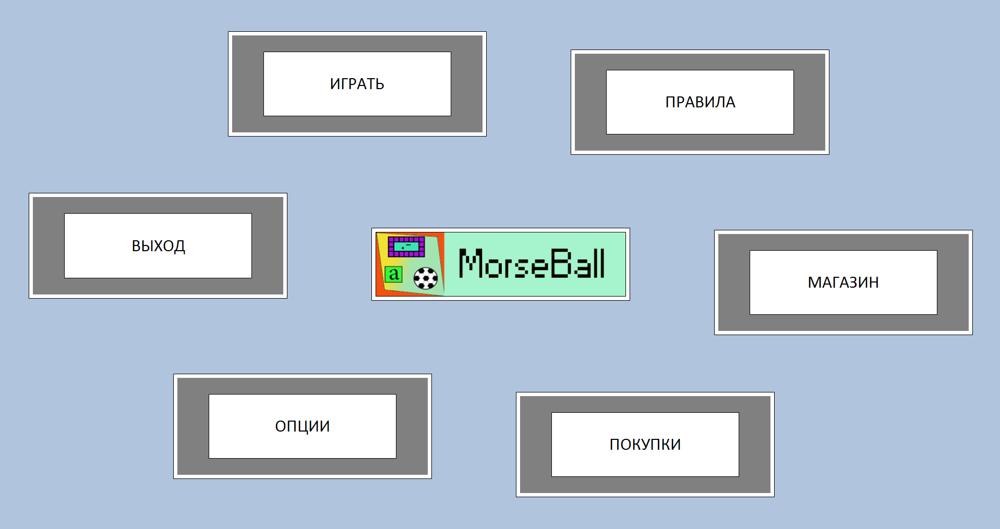
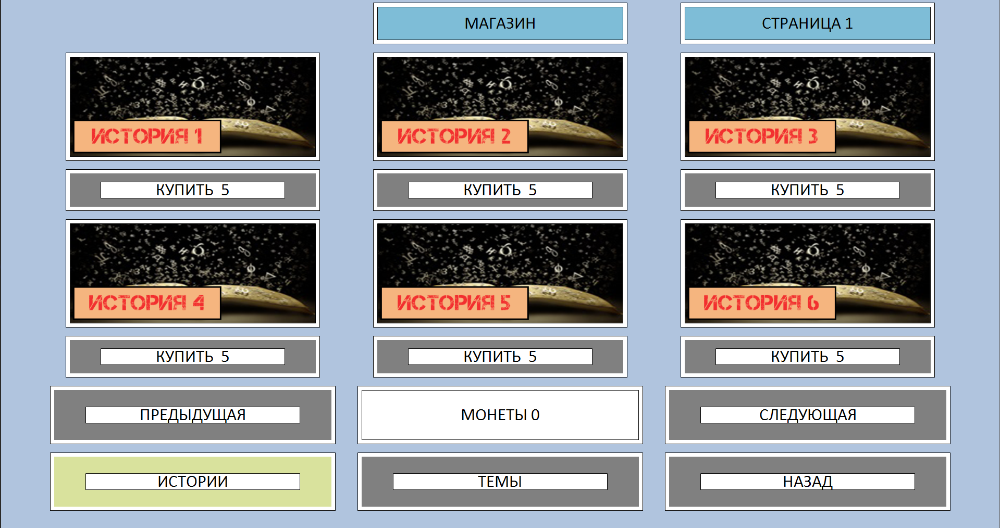
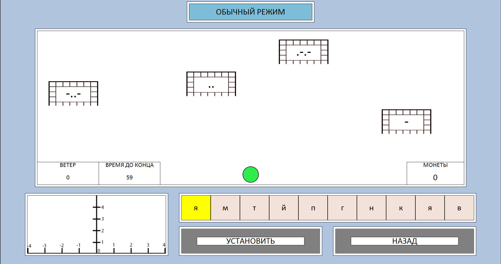
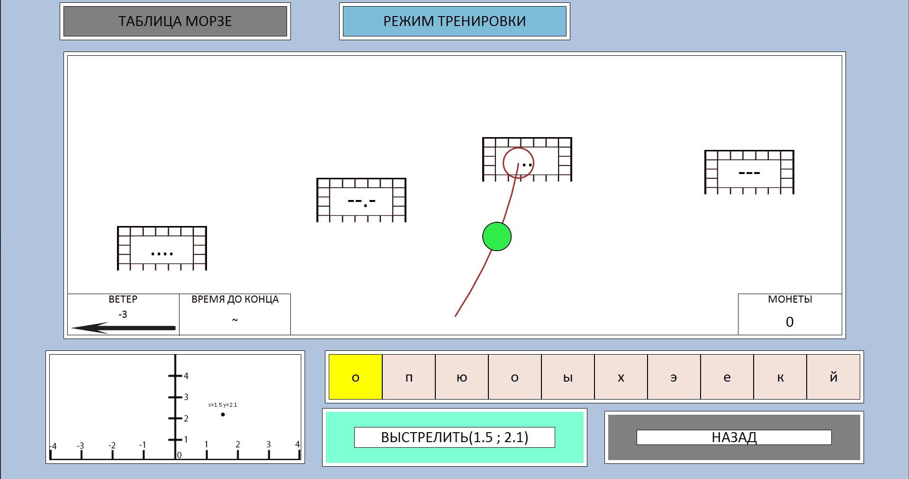

# MorseBall

## Description 
Game, written in Pascal (school project). The idea is to make the learning of Morse code easier and interactive. 

## Getting started

### Necessary tools
- [PascalABC.net](http://pascalabc.net/)
- [Microsoft .NET Framework v4.5.2](https://www.microsoft.com/ru-ru/download/details.aspx?id=42642) (or upper)

### Launch
Start PascalABC.net and open the main file "MorseBall.pas" .
There are 2 lenguages available: Russian and English. You can switch between them in Options.

### Screenshots
Screenshot 1

Screenshot 2

Screenshot 3

